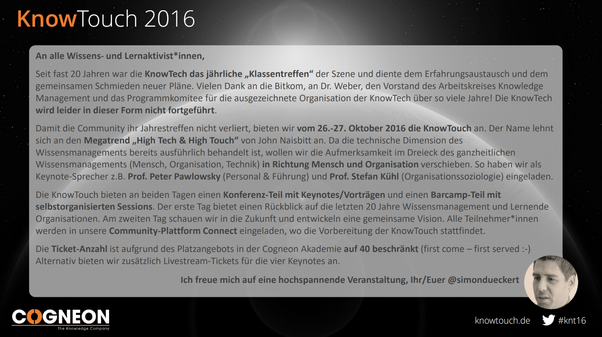

## Anhang

### Geschichte der KnowTouch

Die [Bitkom](https://de.wikipedia.org/wiki/Bitkom), der **Brachenverband der deutschen Informations- und Telekommunikationsbranche**, hat von 1999-2015 die [KnowTech](https://wiki.cogneon.de/KnowTech) als deutsche Leitkonferenz zum Thema Wissensmanagement organisiert. Neben dem regelmäßig tagenden Bitkom Arbeitskreis Knowledge Management war die KnowTech das "jährliche Klassentreffen der Wissensmanager".

Im Jahr **2015** hat die Bitkom die KnowTech zum letzten Mal organisiert und **zugunsten des "Big Data Summit" aufgegeben**. Damit die Funktion des Klassentreffens nicht wegfällt, hat Cogneon die Organisation einer Nachfolgeveranstaltung übernommen. Um den Aufwand der Logistik im Rahmen zu halten, wurde die Anzahl der Plätze auf 40 begrenzt, um die Veranstaltung in der Cogneon Akademie durchführen zu können. Weitere Teilnehmende waren über den Livestream der Keynotes zugeschaltet.

Um nicht mit der Bitkom in lange Verhandlung über Veranstaltungsname und Domain eintreten zu müssen, wurde der Name **"KnowTouch"** in Anlehnung an die [acht Megatrends nach John Naisbitt](https://en.wikipedia.org/wiki/High-touch) (High Tech / High Touch) gewählt. Weitere Informationen zur Veranstaltung befinden sich auf der Seite [KnowTouch 2016](https://wiki.cogneon.de/knt16) in COPEDIA.

### Toolset der KnowTouch 2016

Die knt16 war eine Präsenzveranstaltung mit Livestream, d.h. am Programm konnten Remote-Teilnehmde nicht interaktiv teilnehmen.

- **Infoseite:** CONNECT Community
- **Ticketing:** Xing Events
- **Livestream der Keynotes:** ATEM TV Studio, YouTube Live
- **Kamera 1:** Canon XA25 (ist bei der loscon25 immer noch im Einsatz gewesen)
- **Kamera 2:** Panasonic Camcorder HDC-SD707
- **Winkekatze:** orange
