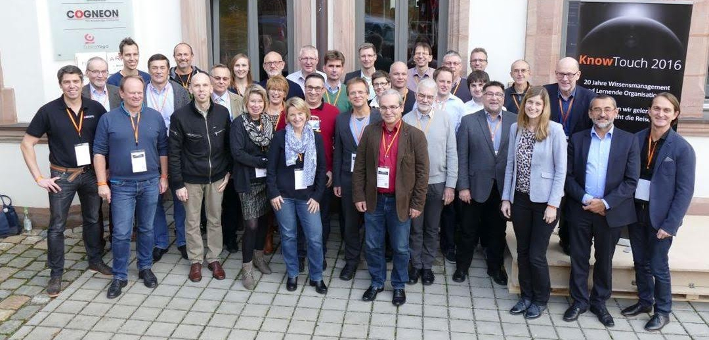

# Willkommen

Die [KnowTouch 2016](https://wiki.cogneon.de/knt16) (#knt16) fand mit 40 Teilnehmer:innen vom 26.-27. Oktober 2016 mit unter dem Motto **"20 Jahre Wissensmanagement? Was haben wir gelernt? Wohin geht die Reise?"** in der Cogneon Akademie in Nürnberg statt. Die KnowTouch ist der Nachfolger der KnowTech und der Urvater der LernOS Convention. Die KnowTouch 2016 bestand aus vier vorgelagerten Webinaren zur Vorbereitung, vier Keynotes, acht Vorträgen und 19 Barcamp Sessions. Moderiert wurde die knt16 von Joachim Niemeier und Karlheinz Pape.

